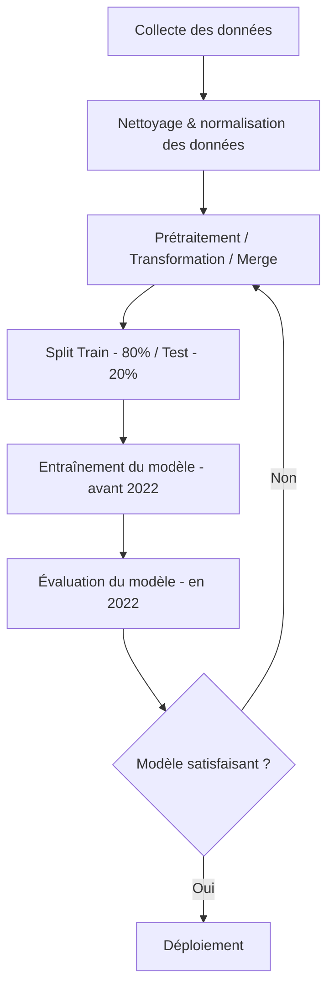

# MSPR3

Le but ici est de prédire les élections présidentielles de 2022 en France se basant sur les précédentes élections depuis 1995.
Nous avons choisi de nous concentrer sur des inidcateurs complémentaires de la région Auvergne Rhône Alpes (AURA - 84).
Tout nos datasets sont issus des sites data.gouv ou inssee.fr.

Sommaire :
1. [TL;DR - lancement de l'app](#tl;dr---lancement-de-l'app-)
2. [Liens des datasets - Auvergne Rhône Alpes](#liens-des-datasets---auvergne-rhône-alpes-)
3. [Architecture du dépôt de code](#architecture-du-dépôt-de-code-)
4. [Collaborateurs](#collaborateurs-)


## TL;DR - lancement de l'app
En premier lieu, faites en sorte d'avoir un environnement python valide avec toutes les dépendances de librairies installées.  
Dans le dossier root du projet clonné, lancer la commande suivante.  
```csh
python ./scripts/__main__.py
```  
Cela va créer les datasets nettoyés et les assembler afin de pouvoir les utiliser pour de l'entrainement et du teste de modèle de ML.  
Si vous souhaitez exporter ces données de manière persistante, utiliser le script de création de base de données SQL `scripts/database/db_creation.sql` puis remplissez la table avec `scripts/database/insert_data_to_db.py`.  
Une fois cela fait, utiliser le fichier `./scripts/machine_learning.ipynb` pour utiliser notre modèle de ML.  
Vous pouvez également sortir d'autres graphiques avec `python ./scripts/visualisation_data.py`

## Méthode
Shéma de traitement des données :


## Liens des datasets - Auvergne Rhône Alpes
L'ensemble des datasets d'origine est répartie dans le dossier   
Numéro de région officiel : 84

### Datasets d'élections
- élections présidentielles : https://www.data.gouv.fr/fr/pages/donnees-des-elections-et-referendums#%C3%89lections%20pr%C3%A9sidentielles  
méthode : sélectionner chaque tours de chaque années d'élection (télécharger le csv qui rends du txt --> convertir), placer T1 et T2 dans le même fichier xlsx et les nommer "Départements T1" et "Départements T2" pour matcher avec le format de chaques années.

### Informations complémentaires
- taux de chomage : https://www.insee.fr/fr/statistiques/serie/001739986#Telechargement
- taux de criminalité (2 fichiers de base statistiques régionnales) : https://www.data.gouv.fr/fr/datasets/bases-statistiques-communale-departementale-et-regionale-de-la-delinquance-enregistree-par-la-police-et-la-gendarmerie-nationales/
- défaillance des entreprises : https://www.insee.fr/fr/statistiques/serie/001740154#Telechargement
- pouvoir d'achat : 

### Pour aller plus loin...
- taux d'inégalité : https://www.insee.fr/fr/outil-interactif/5367857/territoires/30_RPC/31_RNP#

## Architecture du dépôt de code
Cette arborescence est complète une fois le script lancé (génération automatique des dossiers clean + merge)  
La partie qui va nous intéresser du répo est le dossier `scripts/`.  
Il est composé de 3 sous dossiers `data_creation` (crée le fichier final de données), `database` (contient le fichier de création de base de données en SQL et le script de remplissage des données en python) et `notebooks_ml` qui contient les notebooks Jupyter pour la visualisation des modèles de ML.  
```
.
├── .gitignore
├── README.md
├── scripts-app/
│   ├── .env
│   ├── __main__.py
│   ├── data_creation/
│   │   ├── data_cleaning.py
│   │   ├── data_election.py
│   │   └── data_merging.py
│   ├── database/
│   │   ├── db_creation.sql
│   │   └── insert_data_to_db.py
│   ├── notebooks_ml/
│   │   ├── benchmark_algos.ipynb
│   │   └── machine_learning_model.ipynb
└── data-assets/
    ├── original_data/
    │   ├── candidats/
    │   │   └── 
    │   ├── chomage/
    │   │   └── 
    │   ├── criminalite/
    │   │   └── 
    │   ├── defaillance_entreprise/
    │   │   └── 
    │   └── electorales/
    │       └── 
    ├── cleaned_data/
    │   ├── candidats/
    │   │   └── 
    │   ├── chomage/
    │   │   └── 
    │   ├── criminalite/
    │   │   └── 
    │   ├── defaillance_entreprise/
    │   │   └── 
    │   └── electorales/
    │       └── 
    └── merged_data/
        ├── data_merged_by_year.csv
        └── data_merged_by_year.xlsx
```

## Collaborateurs
- CHANELIERE Romain
- CASELLA Théo
- BOUKHEMIRI Rafik